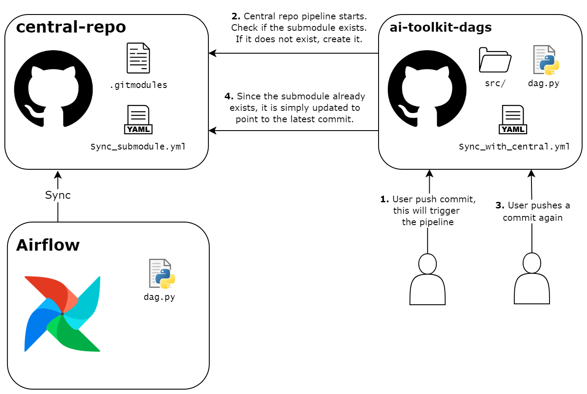
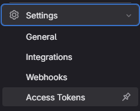
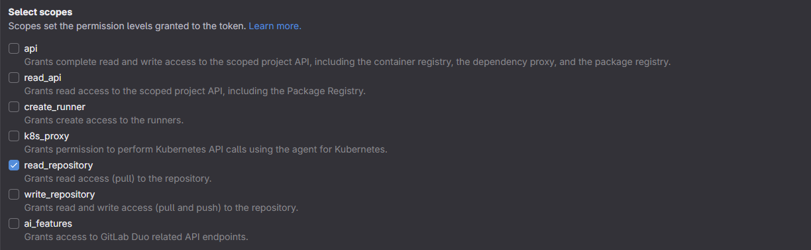
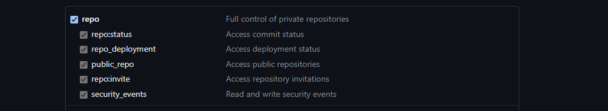
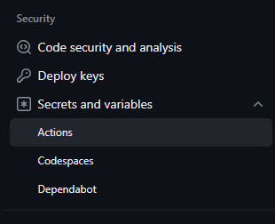
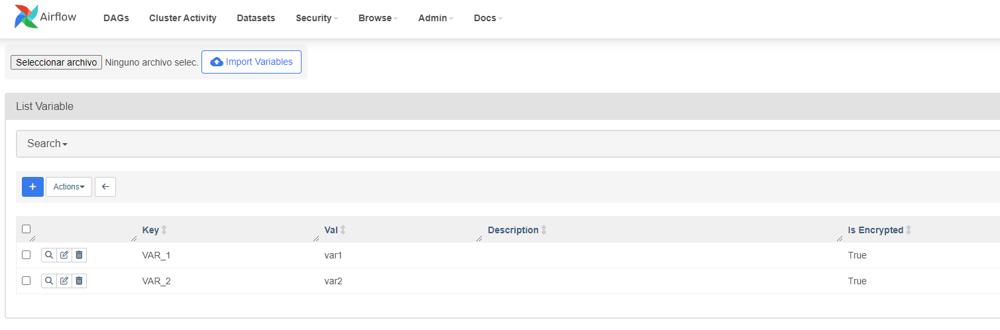

# DAGS

This is an example repository. An instance of `airflow` will get the DAG found here and will be able to execute it if this DAG follows the proper format.

In this repository there is a `master branch` with schema that shows the structure that the DAG should follow, the user only has to modify the indicated values and insert the code where it is specified. In case you want to synchronize with a central repository follow the steps in [Platform as user](#platform-as-user) section

In addition, there is another branch with a functional example of a DAG that will process the data, train 2 different models in parallel, select the one that gives the best result and register it.

## Table of Contents

- [DAGS](#dags)
  - [Table of Contents](#table-of-contents)
  - [DAG structure](#dag-structure)
  - [Platform as user](#platform-as-user)
  - [Private Repositories](#private-repositories)
    - [Generate Project Token](#generate-project-token)
      - [Steps to Generate a Project Token in **GitLab**](#steps-to-generate-a-project-token-in-gitlab)
      - [Steps to Generate a Personal Project Token in **Github**](#steps-to-generate-a-personal-project-token-in-github)
  - [Store secret in Github](#store-secret-in-github)
  - [Passing variables between tasks](#passing-variables-between-tasks)
  - [Load DAGs](#load-dags)
  - [Environment variables](#environment-variables)

## DAG structure

In this new version the DAGs run on top of Kubernetes, each of the tasks runs on a container, giving more flexibility. This new version of the architecture separates the cloud platform from the DAGs and code implementation.

This means that the DAG is not limited in terms of tasks. It is not limited to a number of tasks, nor to the way in which they are executed, either in parallel or sequentially.

Since the tasks run on top of containers, each task is assigned a docker image and runs on top of it. This way the tasks are no longer bound to run on the same version of python as Airflow.

The DAG, on the other hand, needs a previous configuration for its correct functioning. As can be seen at the beginning of the template, the task containers have to be configured before they are executed. The template defines the fields that need to be configured.

The main problem that this pre-configuration solves is the cloning of the repository, as by default Airflow only clones the DAG in the container, so if the DAG makes use of other Python files of the repository, it will not be able to import them.

## Platform as user

In version 3.0 of ai-toolkit, the platform is able to synchronize with a unique Git repository, in order to synchronize more than one repository it is necessary to use a [central repository](https://github.com/CLARUS-Project/ai-toolkit-central) and add submodules that refer to other repositories.

Airflow integrates a component that is in charge of continuously synchronizing with the repository, when it detects submodules, it is able to synchronize with them as well.

These are the steps that the user must follow in order to correctly link his repository to the central repository and consequently load his DAGs in Airflow:

1. Clone this project and go to the master branch. In the `.github/workflows` folder there are 2 yml files, one for private repository and another for public repository, **Delete one of the 2 depending on the visibility of the repository**

2. Create a **access token** check [Steps to Generate a Personal Project Token in **Github**](#steps-to-generate-a-personal-project-token-in-github) section, it can be at user or project level, however, it needs to have **permissions to clone**, then store the **access token** as a project secret with the name **ACCESS_TOKEN**, See the [Store secret in Github](#store-secret-in-github) section. (**ONLY FOR PRIVATE REPOSITORIES**)

3. The **platform manager** should provide the user with a token, which should be saved as a secret named **CENTRAL_REPO_TOKEN**, see the [Store secret in Github](#store-secret-in-github) section.

4. Modify the template that has been cloned previously by following the instructions. When you push the commit, it will be synchronized with the central repository automatically.

This automation is achieved by using 2 different pipelines, one in this project and the other in this project. The resulting flow:



## Private Repositories

In case the repository is private, airflow needs credentials to access the content, a `project token or personal access token` can be used to achieve this. Here are the instructions to generate a project token:

### Generate Project Token

This section provides step-by-step instructions on how to generate an access token in GitLab and Github. This token is used to authenticate applications or scripts with the server, allowing them to perform operations on behalf of a specific user or project. In this case it is used so that Airflow is able to access the repository in case it is private.

#### Steps to Generate a Project Token in **GitLab**

1. Log In to GitLab

    Ensure that you have logged in to your GitLab account.

2. Access the Project

    Navigate to the project for which you want to generate the token.

3. Go to Project Settings

    Within the project, click on the `Settings` tab in the sidebar.

4. Select "Access Tokens"

    In the left sidebar, look for and select the `Access Tokens` option.

    

5. Create a New Access Token

    Click on the `Create Token` button. This will take you to a page where you can configure options for the new token.

6. Configure the Token

    Provide the following information:

    - **Name:** Assign a descriptive name to identify the purpose of the token.
    - **Expires at:** Optionally, set an expiration date for the token.
    - **Scopes:** Select the necessary scopes for the operations the token will perform. In this case you need at least `read_repository`.

    

7. Save the Token

    After configuring the options, click the `Create Token` button to generate the new access token.

8. Copy and Store the Token

    Once created, copy the generated token. It's crucial to store this token in a secure place, as you won't be able to view it again. If you forget the token, you'll need to generate a new one.

    Done! You now have an access token that you can use to authenticate applications or scripts with GitLab and perform operations on behalf of the project.

#### Steps to Generate a Personal Project Token in **Github**

this section will show you how to generate a personal access token but Github already has a project level token in beta, more information here: https://docs.github.com/en/authentication/keeping-your-account-and-data-secure/managing-your-personal-access-tokens#fine-grained-personal-access-tokens

1. Log in to GitHub

    Make sure you are logged into your GitHub account in the browser.

2. Access Account Settings

    Go to the top right corner of the GitHub interface and click on your avatar. Select `Settings` from the dropdown menu.

3. Access Access Tokens

    In the left-hand side menu, at the end, select `Developer settings`, and then click on `Personal access tokens` and `Tokens (classic)`.

4. Generate a New Token

    Click on the `Generate new token` button and then `Generate new token (classic)`. You will be prompted to enter your GitHub password to verify your identity.

5. Configure the Token

    Next, you will see a list of permissions. Check the `repo` box to grant read-only access to your repositories. You can select other permissions as needed.

    

6. Generate Token

    Scroll down and click on "Generate token" at the bottom of the page. Once the token is generated, copy the displayed value. **This will be the only time you can copy it, as it will not be shown again.**


## Store secret in Github

1. In the project go to `Settings`
2. `Secrets and variables` --> `Actions`
   
   
3. Create a `New repository secret`
4. Add a name and copy the Secret value


## Passing variables between tasks

Passing variables from one task to another gets complicated, as each task runs in a different container.

Airflow offers the `x_com` functionality as a workaround but this only works if the variable being shared is an int, string or simple dict. This functionality creates a sidecar container, where the variables that are passed between tasks are stored in json format.

For example to pass a whole dataframe, `x_com` functionality does not work, therefore a `Redis` database has been added to the MLOps structure, this db is a very fast key-value database.

This causes another limitation, the image on which the task is executed must also **include Redis as a dependency** in order to make use of this database.

In the example DAG the dataframe is stored in `Redis` and using `x_com` the identifier with which the dataframe is stored is shared between tasks.

## Load DAGs

To specify to Airflow from which repository it has to load the DAGs, in the `toolkit` repository (https://github.com/CLARUS-HE-Project/ai-toolkit/tree/v2.0.0-red-wine) in the `.env` file it is necessary to modify the variable `AIRFLOW_GIT_SYNC_REPO`

## Environment variables

In case the task uses environment variables, there are 2 ways to define them.

Define them in the dag and pass them as a parameter to a task:

```python
let vars = {
    "VAR_1": "var1",
    "VAR_2": "var2"
}

@task.kubernetes(
    env_vars=vars
)
def task_1():
```

Or define them in the Airflow UI:



And then import them to each task:

```python
from airflow.models import Variable

let vars = {
    "VAR_1": Variable.get("VAR_1"),
    "VAR_2": Variable.get("VAR_2")
}

@task.kubernetes(
    env_vars=vars
)
def task_1():
```

This method is more secure as Airflow encrypts the variables and hides them in the logs.

When deploying the toolkit, a few variables are loaded into Airflow, although these are not visible in the UI. These are the variables, they can be modified beforehand in the respective .env in the [ai-toolkit repository](https://github.com/CLARUS-Project/ai-toolkit/tree/main/Cloud):

    * CONNECTOR_EDGE_IP
    * CONNECTOR_CLOUD_IP
    * AUTH_PROXY_USER
    * AUTH_PROXY_PASSWORD
    * AUTH_ECC_USER
    * AUTH_ECC_PASSWORD
    * IDS_PROXY_PORT
    * ECC_API_PORT
    * IDS_EXTERNAL_ECC_IDS_PORT